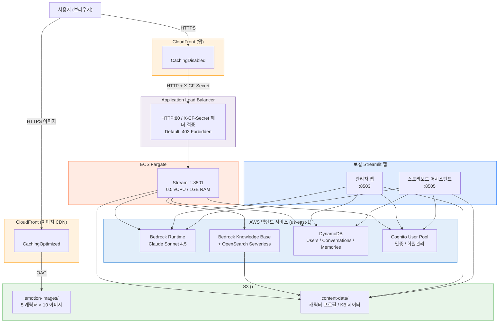

# 캐릭터 챗봇 서비스

캐릭터들과 대화할 수 있는 Streamlit 기반 AI 챗봇입니다. 최근 인기있었던 애니메이션에 나오는 5명의 캐릭터가 각자의 성격과 말투로 대화하며, 감정에 따라 이미지가 변합니다.

## 아키텍처



## AWS 리소스 (us-east-1)

| 리소스 | 이름/ID |
|--------|---------|
| S3 버킷 | `<YOUR_S3_BUCKET>` |
| Cognito User Pool | `<YOUR_COGNITO_USER_POOL_ID>` |
| Bedrock KB | `<YOUR_KB_ID>` |
| ECR 리포지토리 | `<YOUR_ECR_REPO>` |
| ECS 클러스터 | `<YOUR_ECS_CLUSTER>` |
| ECS 서비스 | `<YOUR_ECS_SERVICE>` |
| ALB | `<YOUR_ALB_NAME>` |
| CloudFront (앱) | `<APP_CLOUDFRONT_DOMAIN>` |
| CloudFront (이미지) | `<IMAGE_CLOUDFRONT_DOMAIN>` |

## 프로젝트 구조

```
├── character_chatbot.py           # 메인 Streamlit 챗봇 앱
├── character_chatbot_auth.py      # Cognito 인증 (로그인/회원가입)
├── character_chatbot_memory.py    # 대화 메모리 (DynamoDB/S3/LLM)
├── character_chatbot_scraper.py   # 나무위키 스크래퍼
├── character_chatbot_setup_memory.py  # DDB 테이블 + Cognito 풀 생성
├── character_chatbot_setup_kb.py  # Knowledge Base 설정
├── character_chatbot_run.sh       # 로컬 실행 스크립트
├── chatbot_config.sample.json     # 샘플 설정 (초기 셋업용)
├── requirements.txt               # Python 의존성
│
├── Dockerfile                     # 앱 컨테이너화
├── .dockerignore                  # Docker 빌드 제외 파일
│
├── deploy/
│   ├── upload_images.py           # 로컬 이미지 → S3 업로드
│   ├── setup_image_cdn.py         # 이미지 CloudFront + OAC 생성
│   ├── setup_infra.py             # ECS + ALB + 앱 CloudFront 생성
│   └── deploy.sh                  # Docker 빌드 → ECR 푸시 → ECS 배포
│
├── admin_app.py                   # 관리자 앱 메인 (Cognito 인증 + 메뉴 라우팅)
├── admin_app_data.py              # 관리자 데이터 레이어 (DDB/S3 CRUD + KB 동기화)
├── admin_app_content.py           # 콘텐츠 메타데이터 관리 UI
├── admin_app_characters.py        # 캐릭터 프로필 관리 UI
├── admin_app_scraper.py           # 스크래퍼 파이프라인 UI
├── admin_app_scraper_engine.py    # NamuWiki + Wikipedia + AI 스크래핑 엔진
├── admin_app_sync.py              # S3/KB 동기화 관리 UI
├── admin_app_analytics.py         # 고객 취향 분석 + 콘텐츠 추천 (Bedrock Claude)
├── admin_app_setup.py             # 인프라 설정 (DDB 테이블 + KB 데이터소스)
├── admin_app_seed.py              # 초기 데이터 시딩
├── admin_app_run.sh               # 관리자 앱 실행 스크립트
├── admin_config.sample.json       # 샘플 설정 (초기 셋업용)
│
├── story_app.py                   # 스토리보드 어시스턴트 메인 (Cognito 인증 + 메뉴 라우팅)
├── story_app_dashboard.py         # 스토리 현황 대시보드 (에피소드 관리)
├── story_app_audience.py          # 고객 반응 분석 (AI 요약 + 원본 데이터)
├── story_app_assistant.py         # AI 스토리 어시스턴트 (StoryAssistantManager)
└── story_app_run.sh               # 스토리보드 앱 실행 스크립트
```

> **참고:** `chatbot_config.json`, `admin_config.json`은 `.gitignore`에 포함되어 있습니다.
> 셋업 시 `*.sample.json`을 복사하여 생성하세요.

## 셋업 가이드

### 사전 요구사항

- AWS CLI 설정 (`aws configure`, us-east-1)
- Python 3.11+
- Docker (ECS 배포 시)

### 1단계: 인프라 초기 설정 (최초 1회)

```bash
# Python 의존성 설치
pip install -r requirements.txt

# DynamoDB 테이블 + Cognito User Pool 생성
python character_chatbot_setup_memory.py

# Knowledge Base 설정 (S3 데이터소스 + 벡터 인덱스)
python character_chatbot_setup_kb.py
```

### 2단계: 로컬 실행 (개발용)

```bash
# image_cdn_url이 비어있으면 로컬 image/ 폴더 사용
streamlit run character_chatbot.py --server.port=8501
```

### 3단계: 이미지 CDN 배포

```bash
# 로컬 이미지를 S3에 업로드
python deploy/upload_images.py

# 이미지용 CloudFront 배포 생성 (OAC)
# → chatbot_config.json에 image_cdn_url 자동 저장
python deploy/setup_image_cdn.py
```

### 4단계: ECS 배포

```bash
# ECS 클러스터 + ALB + 앱 CloudFront 생성 (최초 1회)
python deploy/setup_infra.py

# Docker 빌드 → ECR 푸시 → ECS 서비스 업데이트
# (Docker Desktop 문제 시 EC2에서 실행 — 아래 참고)
bash deploy/deploy.sh
```

### EC2에서 Docker 빌드 (Docker Desktop 사용 불가 시)

```bash
# EC2 인스턴스에 SSH 접속
ssh -i <key>.pem ec2-user@<ip>

# Docker 설치
sudo yum install -y docker && sudo systemctl start docker

# 소스 파일 SCP 전송 (로컬에서)
scp -i <key>.pem \
  Dockerfile .dockerignore requirements.txt chatbot_config.json \
  character_chatbot.py character_chatbot_auth.py \
  character_chatbot_memory.py character_chatbot_scraper.py \
  ec2-user@<ip>:~/chatbot-build/

# EC2에서 빌드 + 푸시
cd ~/chatbot-build
sudo docker build -t <YOUR_ECR_REPO>:latest .
aws ecr get-login-password --region us-east-1 | \
  sudo docker login --username AWS --password-stdin <account>.dkr.ecr.us-east-1.amazonaws.com
sudo docker tag <YOUR_ECR_REPO>:latest <account>.dkr.ecr.us-east-1.amazonaws.com/<YOUR_ECR_REPO>:latest
sudo docker push <account>.dkr.ecr.us-east-1.amazonaws.com/<YOUR_ECR_REPO>:latest

# ECS 서비스 업데이트 (로컬 또는 EC2에서)
aws ecs update-service --cluster <YOUR_ECS_CLUSTER> \
  --service <YOUR_ECS_SERVICE> --force-new-deployment --region us-east-1
```

## 설정 파일

> **중요:** `chatbot_config.json`과 `admin_config.json`은 `.gitignore`에 포함되어 있어 Git에 추적되지 않습니다.
> 처음 셋업 시 아래 순서대로 설정 파일을 생성하세요.

### 초기 설정 순서

```bash
# 1. 샘플 파일을 복사하여 설정 파일 생성
cp chatbot_config.sample.json chatbot_config.json
cp admin_config.sample.json admin_config.json

# 2. chatbot_config.json 편집 — Cognito ID는 setup_memory.py 실행 후 자동 생성됨
#    수동 생성 시 아래 값을 채워 넣으세요
vi chatbot_config.json

# 3. admin_config.json 편집 — S3 버킷명, KB ID 등 입력
vi admin_config.json

# 4. 환경변수로도 설정 가능 (Docker/ECS 배포 시 권장)
export S3_BUCKET_NAME="your-bucket-name"
export IMAGE_CDN_URL="https://your-cloudfront-domain"
export CF_ALB_SECRET="your-alb-secret-value"
```

### 설정값 확인 방법 (AWS 리소스 ID)

> **보안 참고:** 설정 파일(`chatbot_config.json`, `admin_config.json`)은 `.gitignore`에 의해 Git에 추적되지 않습니다.
> Git 히스토리 정리(filter-repo) 이후 또는 새 환경에서 셋업할 때 아래 명령으로 각 값을 확인할 수 있습니다.

```bash
# ── Cognito User Pool ID / Client ID ──
# setup_memory.py 실행 시 자동 생성 및 chatbot_config.json에 저장됨
# 이미 생성된 경우 아래 명령으로 확인:
aws cognito-idp list-user-pools --max-results 10 --query "UserPools[?Name=='character-chatbot-pool'].[Id]" --output text
aws cognito-idp list-user-pool-clients --user-pool-id <POOL_ID> --query "UserPoolClients[0].ClientId" --output text

# ── S3 버킷명 ──
aws s3 ls | grep character    # 또는 프로젝트용 버킷명 직접 확인

# ── Bedrock Knowledge Base ID / Data Source ID ──
aws bedrock-agent list-knowledge-bases --query "knowledgeBaseSummaries[?name=='character-chatbot-knowledge-base'].[knowledgeBaseId]" --output text
aws bedrock-agent list-data-sources --knowledge-base-id <KB_ID> --query "dataSourceSummaries[*].[dataSourceId,name]" --output table

# ── CloudFront Distribution (이미지 CDN / 앱) ──
aws cloudfront list-distributions --query "DistributionList.Items[*].[Id,DomainName,Comment]" --output table

# ── ALB DNS ──
aws elbv2 describe-load-balancers --names <YOUR_ALB_NAME> --query "LoadBalancers[0].DNSName" --output text

# ── ECS 클러스터 / 서비스 ──
aws ecs list-clusters --query "clusterArns" --output table
aws ecs list-services --cluster <YOUR_ECS_CLUSTER> --query "serviceArns" --output table
```

| 설정값 | 자동 생성 스크립트 | 수동 확인 명령 |
|--------|-------------------|----------------|
| `cognito_user_pool_id` | `character_chatbot_setup_memory.py` | `aws cognito-idp list-user-pools` |
| `cognito_client_id` | `character_chatbot_setup_memory.py` | `aws cognito-idp list-user-pool-clients` |
| `bucket_name` | (수동 생성) | `aws s3 ls` |
| `knowledge_base_id` | `character_chatbot_setup_kb.py` | `aws bedrock-agent list-knowledge-bases` |
| `content_data_source_id` | `admin_app_setup.py` | `aws bedrock-agent list-data-sources` |
| `image_cdn_url` | `deploy/setup_image_cdn.py` | `aws cloudfront list-distributions` |
| `app_cloudfront_domain` | `deploy/setup_infra.py` | `aws cloudfront list-distributions` |
| `alb_dns` | `deploy/setup_infra.py` | `aws elbv2 describe-load-balancers` |

### chatbot_config.json

```json
{
  "cognito_user_pool_id": "<YOUR_COGNITO_USER_POOL_ID>",
  "cognito_client_id": "<YOUR_COGNITO_CLIENT_ID>",
  "region": "us-east-1",
  "bucket_name": "<YOUR_S3_BUCKET>",
  "dynamodb_tables": {
    "users": "CharacterChatbot-Users",
    "conversations": "CharacterChatbot-Conversations",
    "memories": "CharacterChatbot-Memories"
  },
  "image_cdn_url": "<YOUR_IMAGE_CDN_URL>",
  "image_cdn_distribution_id": "<YOUR_IMAGE_CDN_DISTRIBUTION_ID>"
}
```

### admin_config.json

```json
{
  "region": "us-east-1",
  "bucket_name": "<YOUR_S3_BUCKET>",
  "knowledge_base_id": "<YOUR_KB_ID>",
  "content_data_source_id": "<YOUR_DATA_SOURCE_ID>",
  "content_data_prefix": "content-data/",
  "cognito_user_pool_id": "<YOUR_COGNITO_USER_POOL_ID>",
  "cognito_client_id": "<YOUR_COGNITO_CLIENT_ID>",
  "dynamodb_tables": {
    "metadata": "ContentCatalog-Metadata",
    "characters": "ContentCatalog-Characters",
    "relationships": "ContentCatalog-Relationships"
  },
  "app_cloudfront_domain": "<YOUR_APP_CLOUDFRONT_DOMAIN>",
  "app_cloudfront_distribution_id": "<YOUR_APP_CLOUDFRONT_DISTRIBUTION_ID>",
  "alb_dns": "<YOUR_ALB_DNS>",
  "ecs_cluster": "<YOUR_ECS_CLUSTER>",
  "ecs_service": "<YOUR_ECS_SERVICE>"
}
```

### 환경변수 (설정 파일 대체/보완)

| 환경변수 | 설명 | 우선순위 |
|----------|------|----------|
| `S3_BUCKET_NAME` | S3 버킷명 | config 파일보다 우선 |
| `IMAGE_CDN_URL` | 이미지 CloudFront 도메인 | config 파일보다 우선 |
| `CF_ALB_SECRET` | ALB X-CF-Secret 헤더 값 | deploy.sh 필수 |

### 자동 생성 시점

| 설정 파일 | 자동 생성 스크립트 | 생성 항목 |
|-----------|-------------------|-----------|
| `chatbot_config.json` | `character_chatbot_setup_memory.py` | Cognito User Pool ID, Client ID |
| `chatbot_config.json` | `deploy/setup_image_cdn.py` | image_cdn_url, distribution_id |
| `admin_config.json` | `admin_app_setup.py` | DDB 테이블명, KB 데이터소스 등 |

## 관리자 앱 (admin_app)

콘텐츠/캐릭터 관리와 고객 분석 기능을 제공하는 Streamlit 기반 관리 도구입니다.

```bash
streamlit run admin_app.py --server.port 8503
```

### 메뉴 구성

| 메뉴 | 기능 |
|------|------|
| 콘텐츠 관리 | 콘텐츠 메타데이터 CRUD (ContentCatalog-Metadata) |
| 캐릭터 관리 | 캐릭터 프로필 CRUD + S3 디폴트 이미지 미리보기 |
| 데이터 수집 | NamuWiki/Wikipedia 스크래핑 → AI 정제 파이프라인 |
| KB 동기화 | DDB → S3 자연어 프로필 → Bedrock KB 인제스천 |
| 고객 취향 분석 | 사용자 데이터 기반 AI 분석 & 콘텐츠 추천 |

### 고객 취향 분석

DDB/S3에 저장된 사용자 데이터를 종합하여 Bedrock Claude로 분석합니다.

**데이터 소스:**

| 테이블/경로 | 수집 항목 |
|---|---|
| CharacterChatbot-Users | 프로필 (닉네임, 성별, 생일, 관심사, 취향, 선호 주제) |
| CharacterChatbot-Conversations | 대화 통계 (캐릭터별 대화 수, 감정 분포, 키워드) |
| CharacterChatbot-Memories | 장기 기억 (preference, fact, emphasis 카테고리별) |
| S3 chat-logs/{user_id}/ | 최근 대화 로그 샘플 |
| ContentCatalog-Metadata | 콘텐츠 카탈로그 (추천 대상) |
| ContentCatalog-Characters | 캐릭터 목록 (추천 근거) |

**분석 탭:**
- **고객 취향 분석** — 종합 프로필, 캐릭터 선호도, 관심 주제, 감정 패턴, 참여도, 성격 추정
- **콘텐츠 추천 예측** — 매칭 점수 + 추천 이유 3가지 (콘텐츠가 여러 개 등록되어야 비교 추천 가능)

**모델:** Claude Sonnet 4.5 (primary) → Claude Sonnet 4 (fallback)

## 스토리보드 어시스턴트 (story_app)

스토리 작가를 위한 AI 기반 스토리 기획 도구입니다. 고객 반응 분석과 AI 스토리 가이드/초안 생성 기능을 제공합니다.

```bash
streamlit run story_app.py --server.port 8505
```

### 메뉴 구성

| 메뉴 | 기능 |
|------|------|
| 스토리 현황 | 콘텐츠 개요, 캐릭터 맵, 세계관 설정, 작가 메모 |
| 고객 반응 | AI 분석 요약 (캐릭터 인기도, 감정 패턴, 참여도) + 원본 데이터 열람 |
| AI 어시스턴트 | 스토리 방향 가이드 생성 + 에피소드 초안 작성 (Bedrock Claude) |

### 공유 컴포넌트

- **AdminDataManager** (admin_app_data.py) — 콘텐츠/캐릭터/관계 데이터 조회
- **CustomerAnalyticsManager** (admin_app_analytics.py) — 사용자 데이터 수집 + AI 분석
- **StoryAssistantManager** (story_app_assistant.py) — 스토리 가이드 + 초안 생성

**모델:** Claude Sonnet 4.5 (primary) → Claude Sonnet 4 (fallback)

## DynamoDB 스키마

### 챗봇 테이블

#### CharacterChatbot-Users

사용자 프로필 및 온보딩 상태. 챗봇 로그인 시 자동 생성, 대화 중 LLM이 정보를 추출하여 업데이트.

| 키 | 타입 | 설명 |
|----|------|------|
| `user_id` (PK) | S | Cognito sub UUID |
| `email` | S | 이메일 |
| `display_name` | S | Cognito 표시명 |
| `nickname` | S | 대화 중 수집한 닉네임 |
| `gender` | S | "male" / "female" (대화에서 추론) |
| `birthday` | S | "YYYY-MM-DD" |
| `interests` | L\<S\> | 관심사/취미 |
| `kpop_preferences` | M | 콘텐츠 취향 (favorite_group, favorite_music_genre 등) |
| `preferred_topics` | L\<S\> | 선호 대화 주제 |
| `onboarding_complete` | BOOL | 온보딩 5단계 완료 여부 |
| `onboarding_step` | N | 현재 온보딩 단계 (0-5) |
| `total_sessions` | N | 총 로그인 세션 수 |
| `created_at` | S | ISO 8601 |
| `updated_at` | S | ISO 8601 |
| `last_login_at` | S | ISO 8601 |

#### CharacterChatbot-Conversations

대화 세션 요약. 캐릭터 전환 또는 세션 종료 시 LLM이 대화를 분석하여 저장.

| 키 | 타입 | 설명 |
|----|------|------|
| `user_id` (PK) | S | 사용자 ID |
| `conversation_id` (SK) | S | `{캐릭터}#{session_start}` |
| `character` | S | 대화 캐릭터명 |
| `session_start` | S | 세션 시작 시각 (ISO 8601) |
| `session_end` | S | 세션 종료 시각 |
| `message_count` | N | 메시지 수 |
| `summary` | S | LLM이 생성한 대화 요약 |
| `keywords` | L\<S\> | 핵심 키워드 (최대 5개) |
| `user_sentiment` | S | "positive" / "neutral" / "negative" |
| `topics_discussed` | L\<S\> | 논의 주제 |
| `new_user_info` | M | 대화에서 새로 발견된 사용자 정보 |
| `s3_log_path` | S | 원본 대화 로그 S3 경로 |

GSI: `CharacterTimeIndex` (user_id + session_start, 시간순 조회)

#### CharacterChatbot-Memories

LLM이 대화에서 추출한 장기 기억. 다음 대화 시 컨텍스트로 주입하여 개인화된 대화 제공.

| 키 | 타입 | 설명 |
|----|------|------|
| `user_id` (PK) | S | 사용자 ID |
| `memory_id` (SK) | S | `{character}#{uuid12}` |
| `character` | S | "global" (전체 공유) 또는 특정 캐릭터명 |
| `category` | S | fact / preference / emphasis / relationship / event |
| `content` | S | 기억 내용 (한 문장) |
| `importance` | N | 중요도 1-5 (5=사용자가 명시적으로 강조) |
| `active` | BOOL | 활성 여부 |
| `reference_count` | N | 대화 시 참조된 횟수 |
| `source_conversation` | S | 출처 conversation_id |
| `created_at` | S | ISO 8601 |
| `last_referenced` | S | 마지막 참조 시각 |

GSI: `CharacterMemoryIndex` (user_id + character, 캐릭터별 메모리 조회)

---

### 콘텐츠 카탈로그 테이블

#### ContentCatalog-Metadata

콘텐츠(작품) 메타데이터. 관리자 앱에서 CRUD.

| 키 | 타입 | 설명 |
|----|------|------|
| `content_id` (PK) | S | 콘텐츠 slug |
| `title` | S | 한글 제목 |
| `title_en` | S | 영문 제목 |
| `genre` | L\<S\> | 장르 |
| `platform` | S | 플랫폼 |
| `release_date` | S | 공개일 |
| `format` | S | 포맷 (극장판, 시리즈 등) |
| `runtime` | S | 러닝타임 |
| `creator` | S | 원작자 |
| `director` | L\<S\> | 감독 |
| `writer` | L\<S\> | 각본 |
| `production` | S | 제작사 |
| `synopsis` | S | 시놉시스 |
| `world_setting` | S | 세계관 설명 |
| `reception` | M | 평점/수상 (rt_score, imdb_score, awards 등) |
| `character_count` | N | 등록 캐릭터 수 |

#### ContentCatalog-Characters

캐릭터 프로필. 콘텐츠별 캐릭터 관리.

| 키 | 타입 | 설명 |
|----|------|------|
| `content_id` (PK) | S | 콘텐츠 ID |
| `character_id` (SK) | S | 캐릭터 slug (예: "rumi") |
| `name` / `name_en` | S | 한글명 / 영문명 |
| `group` | S | 소속 그룹 |
| `role_type` | S | protagonist / antagonist / supporting / mentor |
| `role_in_story` | S | 스토리 내 역할 설명 |
| `personality_traits` | L\<S\> | 성격 키워드 |
| `personality_description` | S | 성격 상세 설명 |
| `abilities` | L\<S\> | 능력 |
| `weapon` | S | 무기 |
| `speaking_style` | S | 말투 특징 |
| `catchphrase` | S | 캐치프레이즈 |
| `background` | S | 배경 스토리 |
| `age` | S | 나이/연령대 |
| `species` | S | 종족 |
| `voice_actor` | M | 성우 (en, kr) |
| `emoji` | S | 대표 이모지 |
| `color_theme` | S | 색상 테마 (hex) |
| `is_playable` | BOOL | 챗봇 대화 가능 여부 |

GSI: `RoleTypeIndex` (content_id + role_type)

#### ContentCatalog-Relationships

캐릭터 간 관계. 양방향/단방향 관계 표현.

| 키 | 타입 | 설명 |
|----|------|------|
| `content_id` (PK) | S | 콘텐츠 ID |
| `relationship_id` (SK) | S | `{source}#{target}#{type}` |
| `source_character` | S | 관계 출발 캐릭터 |
| `target_character` | S | 관계 도착 캐릭터 |
| `relationship_type` | S | 관계 유형 (팀원, 적, 멘토 등) |
| `description` | S | 관계 설명 |
| `bidirectional` | BOOL | 양방향 여부 |
| `key_moments` | L\<S\> | 주요 장면/이벤트 |

## 기술 스택

| 레이어 | 기술 |
|--------|------|
| Frontend | Streamlit |
| AI Model | AWS Bedrock (Claude Sonnet 4.5) |
| Knowledge Base | Bedrock KB + OpenSearch Serverless |
| 인증 | Amazon Cognito |
| 대화 저장 | DynamoDB + S3 |
| 이미지 서빙 | S3 + CloudFront (OAC) |
| 컨테이너 | Docker + ECR |
| 배포 | ECS Fargate + ALB + CloudFront |
| 언어 | Python 3.12 |
